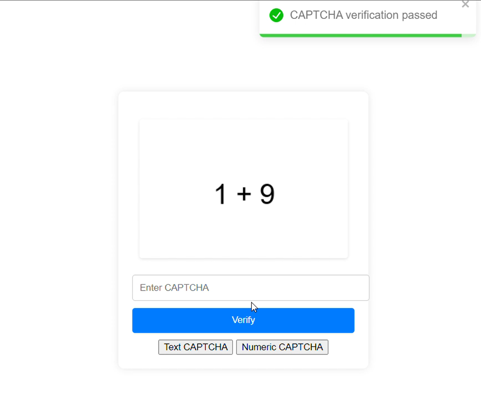

# CAPTCHA System

This project implements a simple CAPTCHA (Completely Automated Public Turing test to tell Computers and Humans Apart) system using Flask for the backend and ReactJS for the frontend.


# App Snaps/Images

Here are some screenshots from the application:

| Screenshot 1 | Screenshot 2 |
| --- | --- |
|  |  |
| Screenshot 3 | Screenshot 4 |
|  |  |


## Technologies

- Backend: Python (Flask)
- Frontend: ReactJS

## Project Structure

The project structure is organized as follows:

- `backend/`: Contains the Flask application code (`app.py`) and the `requirements.txt` file listing Python dependencies.
- `frontend/`: Contains the ReactJS application code, with `public/` for static assets and `src/` for source code.

## Setup Instructions

### Clone Repo
```bash
    git clone https://github.com/NoManNayeem/CAPTCHA-System.git


```

### Backend Setup

1. Navigate to the `backend/` directory.
2. Install Python dependencies: `pip install -r requirements.txt`.
3. Run Flask app: `python app.py`.

### Frontend Setup

1. Navigate to the `frontend/` directory.
2. Install Node.js dependencies: `npm install`.
3. Start React app: `npm start`.

## Development Notes

- **Flask App (`app.py`)**: Implements Flask application with CORS and API endpoints for CAPTCHA generation and verification.
- **CAPTCHA Generators**: Includes logic for generating text and numeric CAPTCHAs.
- **React Components**: Provides simple React components to interact with CAPTCHA challenges.
- **API Communication**: Utilizes Axios or Fetch API in React to communicate with Flask backend.

Feel free to explore and enhance the project as needed!
